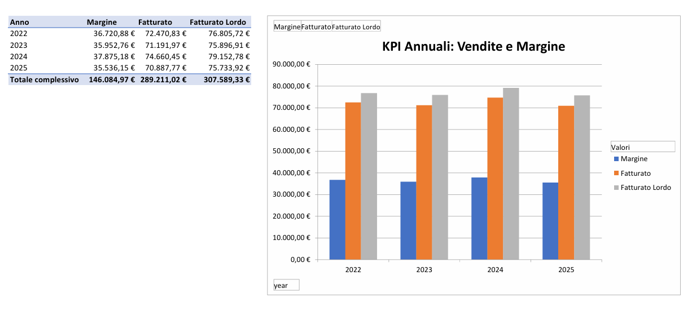

# 🎨 Moda Analytics Automation

## 📝 Descrizione del progetto

Questo progetto è un **sistema di reporting e automazione Excel** sviluppato per il settore moda/abbigliamento, con focus sulla gestione e l'analisi delle vendite.  
L'obiettivo è dimostrare competenze avanzate in **Excel, Power Query, Power Pivot e VBA**, integrando dati da più fonti e generando report automatizzati e KPI direzionali.

Il progetto permette di consolidare dati provenienti da **file CSV ed Excel** e integra le festività italiane tramite **REST API** lato consumer, permettendo di confrontare facilmente le vendite nei giorni festivi rispetto agli altri giorni.Si potrebbero ampliare le fonti di provenienze dei dati, ad esempio collegandosi ad un **database relazionali**, con gestione automatica delle relazioni e delle misure chiave.

---

## 📂 Struttura della repository

moda-analytics-automation/
│
├─ data/
│   ├─ raw/                
│   │   ├─ channels.xlsx
│   │   ├─ customers.xlsx
│   │   ├─ products.xlsx
│   │   └─ sales_raw.csv
│   └─ processed/          # dati puliti da Power Query (facoltativo)
│
├─ reporting/
│   ├─ reporting.xlsm      # Excel con Power Query, Power Pivot e macro VBA
│   └─ KPI_Annuali.pdf     # PDF generato dalle macro
│
├─ images/
│   └─ kpi_annuali.png     # screenshot KPI annuali o altre dashboard
│
├─ README.md               # file completo già pronto
└─ LICENSE                 # MIT License (facoltativa)

---

## ⚡ Funzionalità principali

### 1️⃣ Integrazione dati
- 🔹 Importazione e pulizia dei dati di vendita (`sales_raw.csv`) e master data (`products.xlsx`, `customers.xlsx`, `channels.xlsx`) tramite **Power Query**  
- 🔹 Normalizzazione delle date e integrazione delle festività italiane tramite REST API lato consumer  
- 🔹 Collegamenti tra tabelle senza duplicare dati (solo connessione)  
- 🔹 Possibilità futura di integrare dati da **database relazionali** o altre fonti esterne

### 2️⃣ Modello dati avanzato
- 🔗 Creazione di relazioni tra le tabelle principali (`sales_clean_base`, `products`, `customers`, `channels`, `calendar`, `date festività`) in **Power Pivot**  
- 📊 Misure DAX calcolate:
  - Fatturato netto e lordo
  - Margine
  - Sconto totale e medio
  - Vendite durante le festività
- Dashboard dinamiche con Pivot Table per analisi KPI, vendite per linea e vendite in festività

### 3️⃣ Automazione con VBA
Il file Excel contiene **4 pulsanti principali**, che automatizzano l’intero flusso:

1.  **Aggiorna dati** → aggiorna tutte le query e le Pivot Table dal dataset raw  
2.  **Valida modello** → verifica la coerenza dei dati e segnala eventuali errori  
3.  **Genera report direzionale** → crea un foglio unico che consolida tutte le Pivot Table di servizio  
4.  **Genera PDF KPI annuali** → crea grafico dei KPI annuali e lo esporta in PDF, pronto per condivisione

---

## 📈 Reporting direzionale

Il progetto genera report dinamici per l'analisi di KPI di interesse, tra cui:

-  KPI annuali con trend delle vendite, margine e sconto  
-  Vendite per linea/prodotto filtrabili per anno  
-  Analisi delle vendite durante le festività  

---

## 🛠 Tecnologie utilizzate

-  **Microsoft Excel 2021 Professional Plus**  
-  **Power Query** → importazione e pulizia dati  
-  **Power Pivot** → modello dati relazionale e misure DAX  
-  **VBA** → automazione delle operazioni, generazione PDF e gestione report  
-  **CSV/Excel** → gestione dati raw  
-  Possibilità futura di integrazione con **database relazionali**

---

## 🚀 Come usare il progetto

1. 📂 Aprire `reporting/reporting.xlsm` in Excel con **macro abilitate**  
2. 🔄 Aggiornare i dati tramite il pulsante **Aggiorna dati**  
3. ✅ Validare il modello tramite **Valida modello**  
4. 📑 Generare il report consolidato tramite **Genera report direzionale**  
5. 🖨️ Generare PDF dei KPI annuali tramite **Genera PDF KPI annuali**  

Il PDF viene salvato automaticamente nella cartella `reporting/` come `KPI_Annuali.pdf`.

---

## 🎯 Obiettivo professionale

Questo progetto dimostra la capacità di:

-  Progettare soluzioni Excel robuste e scalabili  
-  Automatizzare flussi di lavoro complessi con VBA  
-  Integrare dati da più fonti eterogenee  
-  Creare modelli dati avanzati con Power Pivot  
-  Realizzare report direzionali e KPI automatizzati, pronti per l’analisi manageriale

In sintesi, è un esempio concreto di competenze avanzate di **analisi dati, automazione e reporting per il settore moda**.

---

## 📜 Licenza

MIT License - vedere file `LICENSE` per i dettagli.